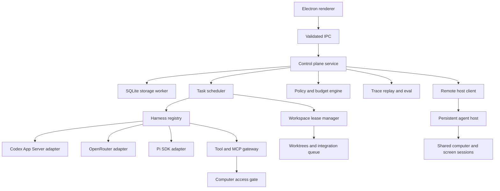
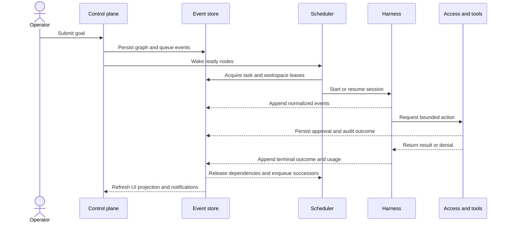
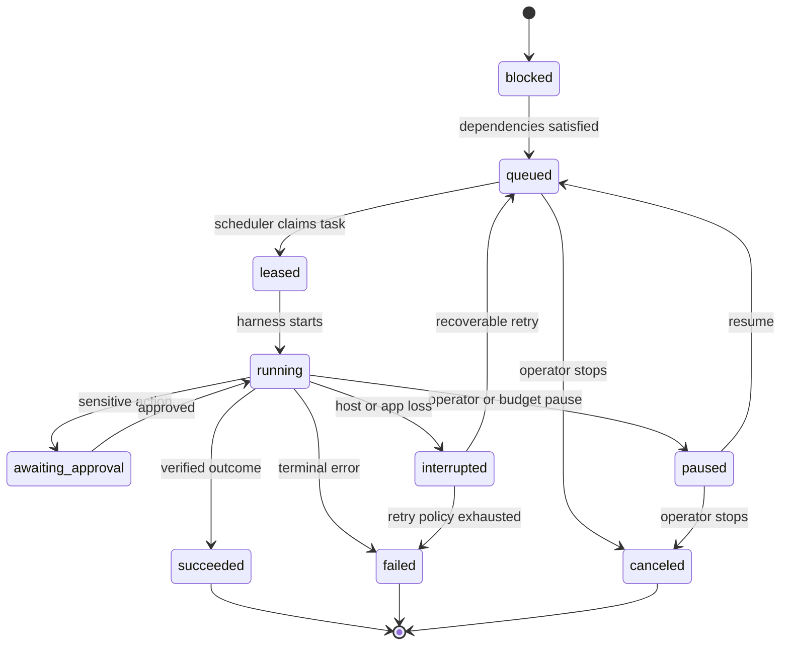
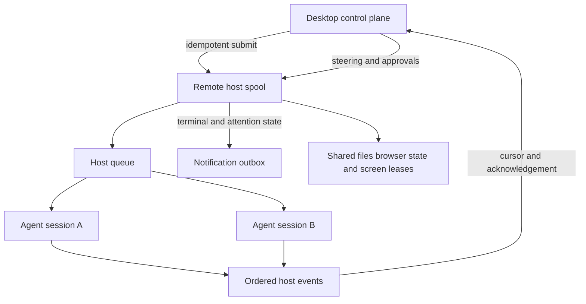
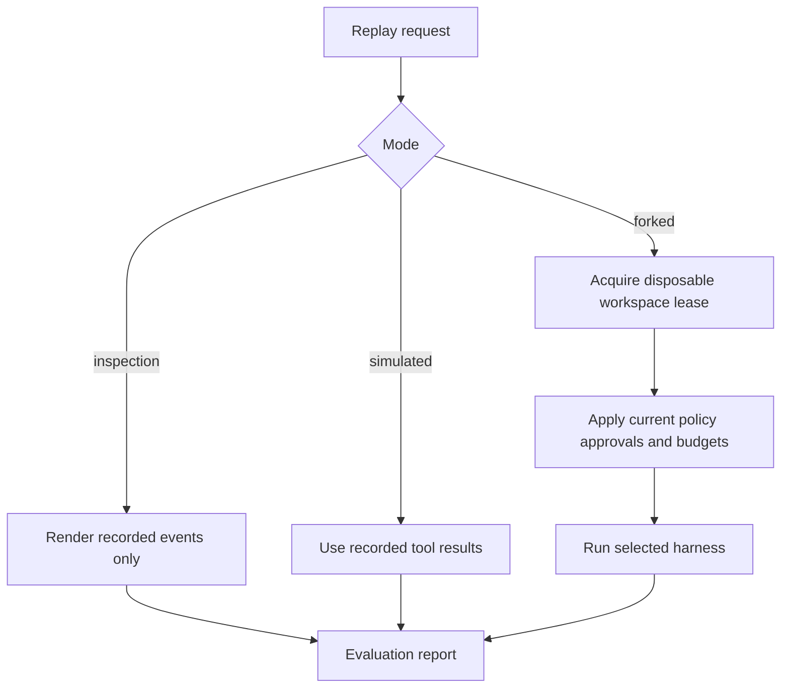

# Multi-Agent Control Plane - Plan

## Goal Capsule

- **Objective:** A single operator can assign, steer, inspect, recover, and evaluate work across a persistent team of named agents without losing control of cost, permissions, source changes, or execution history.
- **Means:** Replace the provider-specific run path with a durable local control plane, harness registry, task graph, worktree isolation, trace system, and remote agent host (KTD1-KTD13).
- **Authority:** Product Requirements define behavior. Key Technical Decisions define implementation constraints. Implementation Units define the delivery sequence.
- **Execution profile:** Deliver the program as compatible releases. Keep current Codex and OpenRouter conversations usable while each new subsystem takes ownership.
- **Stop conditions:** Stop a rollout if legacy data cannot be restored, a harness can bypass Grokky's access gate, a remote host can accept unauthenticated work, or an updater cannot verify the signed artifact.
- **Tail ownership:** The release and operations unit owns migration rollback, updater safety, support documentation, and the final cross-platform acceptance pass.

---

## Product Contract

### Summary

Grokky will become a local-first control plane for persistent AI teammates. It will support Codex, OpenRouter, and Pi through explicit harness adapters; schedule work on a durable task graph; isolate coding agents with Git worktrees; expose live steering, budgets, routing, MCP tools, traces, replay, and evaluation; and progress toward a Grok Bot-style shared remote computer with one screen session per active agent.

The work is a sequence of releasable migrations. Existing chat behavior remains available while the control plane, harnesses, and remote host replace the current in-memory run ownership.

### Problem Frame

Grokky currently presents coordinated agents in the interface, but a conversation still owns one transient provider run. Provider dispatch is hard-coded, progress is stored as bounded arrays inside a JSON snapshot, OpenRouter orchestration is an internal tool loop, and Codex child agents share one working directory. A crash, restart, concurrent writer, or long offline interval therefore breaks the mental model of a durable team.

The missing layer is not another model selector. Grokky needs an execution control plane that owns tasks, leases, policies, histories, and recoverable state independently of any harness. That layer is also the prerequisite for useful replay and evaluation: a team cannot improve from past runs if its decisions, tool calls, handoffs, and outcomes are not durable and comparable.

### Actors

- A1. **Operator:** Creates work, approves sensitive actions, steers active agents, reviews traces, and accepts integrated changes.
- A2. **Named agent:** Retains a role, harness preference, mailbox, routines, and durable working context.
- A3. **Coordinator:** Decomposes goals into task nodes, assigns agents, enforces dependencies, and synthesizes results.
- A4. **Harness adapter:** Translates one execution engine into Grokky's session, event, steering, usage, and cancellation contracts.
- A5. **Runtime host:** Executes local or remote tasks, owns active harness sessions, and reports events through durable cursors.
- A6. **Release operator:** Provides signing credentials, publishes releases, and controls update channels.

### Key Decisions

- **Build the full control-plane roadmap as phased releases** (session-settled: user-directed - chosen over a narrow provider-only extension: the operator wants the complete path toward Grok Bot-style operation). Governs R1-R16.
- **Start local-first and make remote execution a later compatible host** (session-settled: user-approved - chosen over cloud-first deployment: this preserves early usefulness without committing the first releases to VM operations). Governs R2, R3, R14, R15.
- **Use one user-scoped team computer with per-agent screens** (session-settled: user-approved - chosen over one VM per agent: this matches the desired shared-file and shared-login handoff model). Governs R12-R15.
- **Make trace, replay, evaluation, and Git worktrees core capabilities** (session-settled: user-approved - chosen over treating them as optional observability and manual Git practices: they are required for safe iteration and collision-free coding). Governs R7-R10.
- **Defer the DeepSeek harness** (session-settled: user-directed - chosen over including it in the first registry rollout: Codex, OpenRouter, and Pi establish the extension contract first). Governs R1, R16.

### Requirements

**Control plane and orchestration**

- R1. The operator can select Codex, OpenRouter, or Pi per agent or task through a registry that reports each harness's capabilities and readiness.
- R2. Goals decompose into a durable directed acyclic task graph with dependencies, priorities, assignments, attempts, and terminal outcomes.
- R3. Queued and active work survives application restart without duplicating completed side effects or silently abandoning recoverable work.
- R4. The operator can pause, resume, stop, redirect, reprioritize, and message work while the interface shows whether the command was delivered, queued, or rejected.
- R5. Routing policies can select a compatible harness and model from task needs, operator preferences, availability, cost, token, time, concurrency, and risk limits.
- R6. Budget policy pauses or blocks work at configured thresholds and records every routing or budget decision in the run history.

**Workspace and quality**

- R7. Every mutating coding task receives an exclusive workspace lease and, for Git repositories, an isolated worktree and branch.
- R8. Completed branches enter a serialized integration queue that detects conflicts, runs configured verification, and never discards dirty work automatically.
- R9. Every run produces a normalized trace of prompts, harness events, tool calls, approvals, handoffs, usage, artifacts, policy decisions, and outcomes with retention and redaction controls.
- R10. The operator can inspect a trace, replay it without side effects, fork a run from a checkpoint, and evaluate comparable runs against outcome, verification, cost, latency, and policy metrics.

**Tools, agents, and routines**

- R11. OpenRouter can use configured MCP tools through the same validation, approval, audit, secret, timeout, and specialist-read-only boundaries as Grokky-owned tools.
- R12. Named agents retain profiles, harness preferences, session references, mailboxes, role memory, notification preferences, and routines across conversations and restarts.
- R13. Coordinators and operators use the same task, messaging, steering, artifact, and status primitives, except for actions that require human consent.

**Persistent computer and distribution**

- R14. A paired remote agent host can accept durable jobs, continue while the desktop is disconnected, and reconcile ordered events when the desktop returns.
- R15. One user-scoped remote computer shares files and sign-in state while each active agent receives an independently addressable screen session; agent identity is not a security boundary.
- R16. macOS and Windows releases are signed, macOS builds are notarized, published artifacts carry provenance, and updates install only after integrity checks and active-work safeguards pass.

### Key Flows

- F1. **Plan and dispatch a goal**
  - **Trigger:** A1 submits an outcome and optionally chooses agents, policies, or a target project.
  - **Actors:** A1, A2, A3, A4, A5
  - **Steps:** The coordinator builds task nodes; policy resolves compatible routes; workspace leases are acquired; ready nodes are queued and dispatched.
  - **Outcome:** The graph shows runnable, blocked, active, and completed work with a durable reason for every state.
  - **Covered by:** R1-R8, R13
- F2. **Steer and recover active work**
  - **Trigger:** The operator redirects a task, a budget is reached, an approval is needed, a harness fails, or the app restarts.
  - **Actors:** A1, A3, A4, A5
  - **Steps:** The control command is persisted; the adapter delivers it at the strongest supported boundary; the scheduler checkpoints or transitions the task; recovery reconciles leases and sessions.
  - **Outcome:** No command or failure disappears, and the interface distinguishes accepted, pending, and unsupported controls.
  - **Covered by:** R3-R6, R9, R14
- F3. **Integrate and evaluate coding work**
  - **Trigger:** A mutating task reports completion.
  - **Actors:** A1, A2, A3, A5
  - **Steps:** The worktree is inspected; verification runs; integration is serialized; the final diff and trace become evaluation inputs; the operator accepts, retries, or rejects the result.
  - **Outcome:** Concurrent work cannot overwrite another agent's files, and quality comparisons use durable evidence.
  - **Covered by:** R7-R10
- F4. **Run a persistent routine while disconnected**
  - **Trigger:** A saved routine reaches its schedule on a paired remote host.
  - **Actors:** A1, A2, A3, A5
  - **Steps:** The host creates a graph run; agents use shared files or assigned screen sessions; approvals wait safely; terminal or attention states generate notifications; the desktop reconciles on reconnect.
  - **Outcome:** The work continues without the desktop, but sensitive steps still wait for the operator.
  - **Covered by:** R3, R6, R12-R16

### Acceptance Examples

- AE1. **Restart recovery**
  - **Covers:** R2, R3, R9
  - **Given:** A graph has one completed node, one running node, and one dependent queued node.
  - **When:** Grokky exits unexpectedly and restarts.
  - **Then:** The completed node remains terminal, the active attempt is reconciled exactly once, and the dependent node runs only after its dependency has a valid success outcome.
- AE2. **Concurrent coding agents**
  - **Covers:** R7, R8
  - **Given:** Two agents modify overlapping source files from the same base commit.
  - **When:** Both report completion.
  - **Then:** Their edits remain isolated, integration is serialized, and the second branch becomes a visible conflict or verified merge instead of overwriting the first.
- AE3. **Live redirect**
  - **Covers:** R4, R9
  - **Given:** A Codex, Pi, or OpenRouter task is active.
  - **When:** The operator sends a redirect.
  - **Then:** Grokky records the redirect first, delivers it through the adapter's supported steering boundary, and shows the eventual acknowledgement or rejection.
- AE4. **Budget ceiling**
  - **Covers:** R5, R6
  - **Given:** A run has a hard cost or token ceiling and a lower-cost compatible route exists.
  - **When:** The next call would exceed the ceiling.
  - **Then:** Policy either routes before dispatch or pauses the run; it never silently exceeds the hard limit.
- AE5. **MCP side effect**
  - **Covers:** R11, R13
  - **Given:** An OpenRouter specialist requests an MCP tool whose side-effect classification is unknown.
  - **When:** The tool call arrives.
  - **Then:** Grokky treats it as side-effecting, withholds it from read-only specialists, and requires the configured approval path before execution.
- AE6. **Safe replay**
  - **Covers:** R9, R10
  - **Given:** A trace contains file writes, commands, and a third-party tool call.
  - **When:** The operator starts inspection replay.
  - **Then:** Grokky reproduces the event timeline from recorded data without executing any tool or mutating any workspace.
- AE7. **Offline routine**
  - **Covers:** R12, R14, R15
  - **Given:** A scheduled agent has a paired remote host and the desktop is offline.
  - **When:** The schedule fires and later reaches an approval gate.
  - **Then:** The host continues until the gate, persists the waiting state, and the desktop receives ordered events plus an approval notification after reconnecting.
- AE8. **Updater safety**
  - **Covers:** R16
  - **Given:** A signed update is available while a worktree integration or remote reconciliation is active.
  - **When:** The updater downloads the release.
  - **Then:** Grokky verifies the artifact, postpones restart, and installs only after active work is checkpointed or the operator explicitly stops it.

### Success Criteria

- A crash-recovery test can restart the controller at every task lifecycle state without duplicate terminal events or orphaned exclusive leases.
- A representative two-writer coding scenario produces isolated diffs and a deterministic integration outcome.
- Codex and Pi accept true steering, while OpenRouter accepts persisted boundary steering between model or tool rounds.
- Inspection replay performs zero external calls, and forked replay always uses a disposable worktree or remote session.
- Every harness and MCP tool path passes the same denial, timeout, output-cap, abort, and audit tests.
- A remote routine completes or waits for approval while the desktop is disconnected, then reconciles without event gaps.
- Signed package smoke tests pass on native macOS arm64 and Windows x64 runners before the update channel is published.

### Scope Boundaries

**In scope**

- Local single-operator control plane with a remote-ready protocol.
- Codex, OpenRouter, and Pi adapters.
- Coding worktrees plus a shared-computer model for non-Git work.
- Desktop notifications, durable routines, and remote offline execution.
- Browser-first screen sessions followed by general Linux desktop sessions through the same screen contract.

**Deferred to Follow-Up Work**

- DeepSeek harness implementation. The registry must leave a documented adapter extension point for it.
- Hosted multi-user accounts, organization administration, pooled billing, and cross-user collaboration.
- Managed cloud VM provisioning, billing, and fleet operations. The first remote host is user-provisioned.
- Mobile clients. The host and synchronization protocol should not prevent them later.
- Learning a routine from a recorded demonstration. Manually authored and agent-proposed routines ship first.

**Outside this product's identity**

- Treating separate agents on the shared computer as security isolation.
- Bypassing passwords, passkeys, two-factor prompts, CAPTCHAs, purchases, or other human-only consent steps.
- Claiming deterministic model output from replay. Replay guarantees inputs, boundaries, and evidence, not identical generated text.

### Dependencies

- Node.js 22.13 or newer for development and tests, plus Electron 43's Node.js 24 runtime for the built-in SQLite module.
- Local Codex authentication for Codex adapters and host-local credentials for every remote harness.
- Git for worktree-backed projects.
- Apple Developer credentials and a Windows code-signing certificate for public release channels.
- A user-provisioned Linux host or VM and an authenticated encrypted network path for persistent remote operation.

---

## Planning Contract

### Key Technical Decisions

- KTD1. **Use SQLite as a hybrid control-plane store.** A dedicated storage worker owns `node:sqlite`; normalized tables hold durable entities and an append-only event table owns run history. This avoids a native database dependency while keeping task, queue, replay, and evaluation queries transactional. The project raises its Node.js development minimum to 22.13 and verifies the exact Electron runtime at startup.
- KTD2. **Make Grokky the orchestration owner.** The task graph assigns independent harness sessions to nodes. Harness-native subagents remain a compatibility mode, not the default path for work that needs leases, steering, or evaluation.
- KTD3. **Use capability negotiation instead of provider branching.** Each adapter declares session persistence, streaming, steering, follow-up, cancellation, tool, MCP, usage, and computer-control support. Routing rejects incompatible assignments before a run starts.
- KTD4. **Migrate Codex from SDK-only execution to App Server over local stdio.** The current SDK adapter remains during parity rollout. App Server becomes the primary Codex adapter because it exposes thread resume, turn steering, interruption, approvals, goals, and structured notifications. Grokky does not expose App Server's experimental WebSocket listener.
- KTD5. **Embed Pi with its native TypeScript SDK.** Pi built-in write, edit, and shell tools are disabled. Grokky supplies custom tools that route through the existing access gate, which prevents a second ungoverned permission system.
- KTD6. **Place MCP behind a harness-neutral tool gateway.** The gateway discovers schemas through the MCP TypeScript client, namespaces tools by server, stores OAuth material behind the secret adapter, and treats unknown side effects as approval-required. OpenRouter is the first consumer.
- KTD7. **Give every mutating Git task one exclusive worktree lease.** The integration queue is the only component that merges accepted task branches. Read-only work may share a base snapshot, but it never receives a write-capable tool set.
- KTD8. **Persist control commands before delivery.** Steering, pause, resume, cancellation, approval, and reprioritization are durable inbox records. An adapter acknowledges delivery separately from task state, which makes unsupported or delayed control visible.
- KTD9. **Define three replay modes.** Inspection replay reads events only. Simulated replay substitutes recorded tool results. Forked replay invokes models and tools only inside a disposable lease with normal approvals and budgets.
- KTD10. **Let the runtime host own active work while disconnected.** The desktop submits idempotent jobs and mirrors ordered host events by cursor. Once a host accepts an attempt, its lease epoch fences stale desktop or prior-host writers until that attempt reaches a durable hand-back state. The host keeps its own SQLite spool and harness credentials; reconnect reconciliation never relies on the desktop having remained online.
- KTD11. **Model the team computer as shared resources plus screen leases.** Files, browser state, and approved logins belong to the user-scoped host. A screen session belongs to one active agent at a time but does not create a new trust boundary.
- KTD12. **Separate application updates from agent-host updates.** Desktop releases use signed GitHub releases and `electron-updater`. Remote host updates use a separately versioned compatibility protocol so one side can roll back without corrupting queued work.
- KTD13. **Qualify every budget measurement by source and enforceability.** Adapters report whether token, cost, and timing values are authoritative, estimated, delayed, or unavailable. Hard ceilings apply only at a boundary the adapter can actually stop; otherwise policy reserves a configurable margin and labels the remaining limit advisory rather than promising false precision.

### High-Level Technical Design

#### Component topology



#### Durable run sequence



#### Task and attempt lifecycle



#### Remote ownership and reconciliation



#### Replay safety gate



### Output Structure

```text
src/
  main/
    control-plane/
      control-plane-service.ts
      event-projector.ts
      scheduler.ts
      steering-service.ts
      policy-engine.ts
      notification-service.ts
    storage/
      database-worker.ts
      migrations.ts
      legacy-import.ts
      repositories/
    harnesses/
      registry.ts
      types.ts
      codex-sdk-adapter.ts
      codex-app-server-adapter.ts
      openrouter-adapter.ts
      pi-adapter.ts
    workspaces/
      workspace-lease-manager.ts
      worktree-manager.ts
      integration-queue.ts
    tools/
      tool-gateway.ts
      mcp-client-manager.ts
      mcp-auth.ts
    quality/
      trace-service.ts
      replay-service.ts
      eval-service.ts
    team/
      agent-runtime-service.ts
      mailbox-service.ts
      memory-service.ts
      routine-service.ts
    remote/
      host-client.ts
      host-protocol.ts
  runner/
    agent-host.ts
    host-store.ts
    host-scheduler.ts
    screen-session-manager.ts
    browser-screen-provider.ts
    desktop-screen-provider.ts
  renderer/src/features/
    tasks/
    steering/
    traces/
    evaluations/
    team/
    computer/
    updates/
  shared/
    control-plane-contracts.ts
    harness-contracts.ts
    remote-protocol.ts
tests/
  fixtures/migrations/
  fixtures/traces/
  fixtures/remote-host/
```

### Implementation Constraints

- Keep the renderer sandboxed and expose only validated IPC methods. No database, harness, MCP, secret, Git, or remote-host client enters the renderer.
- Preserve the existing access model as the minimum boundary. New harness and MCP tools may narrow access but may not bypass `ComputerAccessService` or workspace containment.
- Store provider and host credentials in their owning runtime. Persist only sealed local tokens or non-secret credential source labels in the desktop database.
- Use stable event IDs, task IDs, attempt IDs, and idempotency keys across retries. Do not infer identity from array order or display labels.
- Cap event payloads, command output, screenshots, trace exports, queue sizes, retry counts, and retention. Store large artifacts by content reference instead of embedding them in snapshots.
- Keep host protocol compatibility additive within a release channel. Reject a host with an incompatible major protocol before submitting work.

### System-Wide Impact

| Boundary | Required change and invariant | Failure propagation and evidence |
| --- | --- | --- |
| Renderer, preload, and main IPC | Replace mutable whole-snapshot commands with validated task, control, policy, trace, agent, host, and update operations. The renderer never receives database handles, raw credentials, unredacted tool arguments, or harness-native clients. | Validation failures remain local to the request and create bounded diagnostics; subscription gaps trigger a projection refresh instead of guessing state. |
| Controller and control-plane services | Move run ownership out of `MainController` incrementally. Each migrated command has one authoritative service and a compatibility facade until its release gate passes. | A compatibility path cannot write the same aggregate as its replacement; startup refuses ambiguous ownership and reports the migration stage. |
| SQLite, events, projections, and artifacts | Commit domain events, projection changes, durable commands, and notification outbox records atomically when they describe one transition. Large or sensitive payloads remain content-addressed artifacts with retention metadata. | Projection rebuilds, event sequence checks, and artifact hashes expose partial writes or corruption; recovery preserves the last valid store and source backup. |
| Scheduler, harnesses, workspaces, and tools | Dispatch requires compatible capabilities plus valid task, attempt, workspace, and policy leases. Every adapter and tool result carries correlation IDs back to the owning attempt. | A lost heartbeat interrupts or fences the attempt; late events from an old lease epoch are retained as diagnostics but cannot mutate current state. |
| Desktop and remote host | The accepting host is authoritative for an active attempt until a terminal event or explicit hand-back. Job IDs, lease epochs, event cursors, and command acknowledgements make reconciliation monotonic. | Network loss changes visibility, not ownership. Version mismatch blocks new work while export, cancellation where safe, and recovery metadata remain available. |
| Shared computer and screen sessions | Browser pages, desktop sessions, screenshots, and input are addressed through revocable screen leases under the user-scoped trust boundary. | Expired or reassigned lease input is rejected; takeover pauses agent input and never records human-entered secrets as model-visible trace text. |
| Budgets, traces, and evaluations | Usage preserves provider-reported values and derivation metadata. Trace redaction occurs before export, while local retention and evaluation references remain explicit. | Unknown or delayed cost becomes advisory, not zero; a redaction or retention failure blocks export and records which evidence was withheld. |
| Packaging and updates | Database and protocol compatibility are checked before restart. Renderer state, active attempts, approvals, integration work, and host reconciliation participate in the safe-restart gate. | A failed signature, migration, health check, or compatibility check leaves the prior release and recoverable data available and prevents the new version from owning work. |

### Phased Delivery

| Release | Units | Operator-visible outcome |
| --- | --- | --- |
| 0.2 foundation | U1-U3 | Durable SQLite state, normalized events, and a harness registry wrapping current behavior |
| 0.3 orchestration | U4-U6 | Real task graph, restart-safe queues, worktrees, steering, budgets, routing, and notifications |
| 0.4 harness parity | U7-U9 | Codex App Server, Pi SDK, and OpenRouter MCP behind one control contract |
| 0.5 quality | U10 | Trace inspection, safe replay, forked reruns, and evaluation comparisons |
| 0.6 persistent team | U11 | Durable named agents, mailboxes, memories, and routines |
| 0.7 remote operation | U12-U13 | Offline remote execution and shared computer screen sessions |
| 1.0 distribution | U14 | Signed, notarized, provenance-attested, automatically updated releases |

### Alternative Approaches Considered

| Alternative | Why it was not selected |
| --- | --- |
| Extend the JSON snapshot | It cannot provide transactional leases, ordered event queries, queue recovery, or practical evaluation datasets without becoming a database in application code. |
| Use `better-sqlite3` | It adds Electron native-module ABI and packaging work that the built-in Node.js 24 SQLite runtime avoids. |
| Let each harness orchestrate its own agents | Grokky would remain unable to assign worktrees, enforce one policy model, deliver consistent steering, or compare task outcomes across harnesses. |
| Keep Codex on the SDK only | The SDK covers start, resume, streaming, and abort, but App Server exposes the steering and approval surface required by R4. |
| Integrate Pi through RPC mode | Pi's SDK is preferred in a Node.js process and gives direct control of tools, events, persistent sessions, steering, and resource loading. RPC remains a future isolation option. |
| Give every agent a separate VM | It weakens shared-login and shared-file handoffs, increases operating cost, and diverges from the confirmed team-computer model. |
| Put the control plane in a hosted service first | It delays local value and introduces accounts, tenancy, billing, and server operations outside the confirmed scope. |

### Risks and Mitigations

| Risk | Mitigation |
| --- | --- |
| Legacy JSON migration loses or duplicates conversations | Keep the source file as a timestamped backup, make import idempotent, compare entity counts and stable IDs, and switch the active store only after projection verification. |
| SQLite writes stall Electron | Own the database in a worker, batch append-only events in transactions, bound projection work, and measure queue latency before expanding retention. |
| Harness capability differences leak into user expectations | Render adapter capabilities and control delivery status; reject unsupported routing before dispatch; keep adapter contract tests with shared fixtures. |
| Pi or MCP bypasses access policy | Disable Pi built-ins, expose only gateway tools, default unknown MCP tools to side-effecting, and test negative boundaries before live smoke checks. |
| Worktree cleanup destroys unmerged work | Never force-remove a dirty lease automatically; archive its metadata and require an explicit operator discard after a recoverability check. |
| Traces expose private workspace or tool content | Exclude credentials, redact configured fields, cap payloads, keep files private to the OS user, provide retention controls, and require redacted export for eval datasets. |
| Remote disconnect duplicates jobs or loses events | Use idempotent job IDs, host-owned leases, ordered event cursors, acknowledgements, and reconciliation tests with dropped and repeated frames. |
| Desktop and host both believe they own an attempt | Fence every accepted attempt with a monotonically increasing lease epoch, reject late writes from prior owners, and require an explicit durable hand-back before reassignment. |
| Shared browser state corrupts under concurrency | Use one browser-session broker and explicit page or screen leases; never let separate processes mutate the same browser profile concurrently. |
| Agent screens are mistaken for isolation | State the boundary in UI and docs; enforce security at the user-scoped host, capability, workspace, and approval layers. |
| Automatic update interrupts active work | Download in the background, gate restart on checkpointable state, verify signatures and metadata, and retain a rollback-compatible store and protocol. |
| Delayed or estimated usage makes a hard budget look exact | Preserve usage provenance, reserve an adapter-specific safety margin, stop only at enforceable boundaries, and label non-enforceable limits as advisory in policy and trace views. |

### Sources and Research

- Existing architecture: `README.md`, `docs/ARCHITECTURE.md`, `docs/CODEX-SDK.md`, `docs/OPENROUTER.md`, and `docs/SECURITY.md`.
- Current dispatch and persistence seams: `src/main/controller.ts`, `src/main/providers/types.ts`, `src/main/state-store.ts`, `src/main/computer-access.ts`, and `src/main/runner-service.ts`.
- [Codex SDK](https://learn.chatgpt.com/docs/codex-sdk) for local thread start, continuation, resume, and streaming.
- [Codex App Server](https://learn.chatgpt.com/docs/app-server) for local JSON-RPC threads, turn steering, interruption, approvals, goals, and event notifications.
- [Pi SDK](https://pi.dev/docs/latest/sdk) for native sessions, persistent session managers, custom tools, steering, follow-up, events, and resource loading.
- [MCP TypeScript client](https://ts.sdk.modelcontextprotocol.io/client) and [MCP authorization](https://modelcontextprotocol.io/specification/2025-06-18/basic/authorization) for transports, tool discovery, OAuth, PKCE, resource indicators, and secure token boundaries.
- [Grok Bot overview](https://docs.x.ai/grok-bot/overview) and [security model](https://docs.x.ai/grok-bot/approvals-security-and-privacy) for persistent named agents, one user-scoped computer, per-agent screens, shared sessions, handoffs, and human takeover.
- [Node.js SQLite](https://nodejs.org/download/release/latest-v24.x/docs/api/sqlite.html) and [Electron 43](https://www.electronjs.org/blog/electron-43-0) for the built-in database runtime decision.
- [Git worktree](https://git-scm.com/docs/git-worktree.html) for linked-worktree lifecycle, locking, removal, repair, and pruning.
- [Electron auto-update](https://www.electron.build/docs/features/auto-update/), [Electron code signing](https://www.electronjs.org/docs/latest/tutorial/code-signing), and [GitHub artifact attestations](https://docs.github.com/en/actions/how-tos/secure-your-work/use-artifact-attestations/use-artifact-attestations) for the distribution path.

---

## Implementation Units

### Unit Index

| Unit | Title | Primary files | Depends on |
| --- | --- | --- | --- |
| U1 | SQLite control-plane store | `src/main/storage/`, `src/main/state-store.ts` | None |
| U2 | Event model and projections | `src/shared/control-plane-contracts.ts`, `src/main/control-plane/` | U1 |
| U3 | Harness registry | `src/main/harnesses/`, `src/main/providers/` | U2 |
| U4 | Task graph and durable scheduler | `src/main/control-plane/scheduler.ts`, `src/renderer/src/features/tasks/` | U2, U3 |
| U5 | Worktree and integration queue | `src/main/workspaces/` | U4 |
| U6 | Steering, routing, budgets, notifications | `src/main/control-plane/`, `src/renderer/src/features/steering/` | U3, U4 |
| U7 | Codex App Server adapter | `src/main/harnesses/codex-app-server-adapter.ts` | U3, U6 |
| U8 | Pi SDK adapter | `src/main/harnesses/pi-adapter.ts` | U3, U6 |
| U9 | MCP tool gateway | `src/main/tools/`, `src/renderer/src/features/team/` | U3, U6 |
| U10 | Trace, replay, and evaluation | `src/main/quality/`, `src/renderer/src/features/traces/` | U2, U4-U9 |
| U11 | Persistent agents and routines | `src/main/team/`, `src/renderer/src/features/team/` | U4, U6, U10 |
| U12 | Remote agent host | `src/runner/`, `src/main/remote/` | U1-U4, U6, U11 |
| U13 | Shared computer and screen sessions | `src/runner/screen-session-manager.ts`, `src/renderer/src/features/computer/` | U12 |
| U14 | Signed releases and updates | `package.json`, `.github/workflows/`, `src/main/update-service.ts` | U1, U12, U13 |

### Phase 1: Durable foundation

### U1. SQLite control-plane store and legacy migration

- **Goal:** Replace whole-file JSON persistence with a transactional store while preserving every valid existing conversation, setting, computer record, and audit entry.
- **Requirements:** R3, R9, R16
- **Dependencies:** None
- **Files:** Create `src/main/storage/database-worker.ts`, `src/main/storage/database-client.ts`, `src/main/storage/migrations.ts`, `src/main/storage/legacy-import.ts`, and `src/main/storage/repositories/`. Modify `src/main/state-store.ts`, `src/main/index.ts`, `package.json`, and `docs/ARCHITECTURE.md`. Create `tests/database-worker.test.ts`, `tests/storage-migrations.test.ts`, `tests/legacy-import.test.ts`, and `tests/fixtures/migrations/`.
- **Approach:**
  1. Raise the development engine floor to Node.js 22.13 and add a startup capability check for `node:sqlite`.
  2. Put the single database connection in a worker and expose typed request and transaction operations to the main process.
  3. Create versioned, forward-only migrations for settings, conversations, messages, agents, runs, events, tasks, policies, devices, and secrets metadata.
  4. Import the version 2 JSON file once under an idempotency marker, validate counts and stable IDs, and retain the original as a recoverable backup.
  5. Keep a read-through compatibility facade until U2 moves controller projections to repositories.
- **Execution note:** Add fixture-driven migration and rollback-safety tests before switching the production store path.
- **Patterns to follow:** Atomic file handling and normalization in `src/main/state-store.ts`; private file permissions and bounded collections in `docs/SECURITY.md`.
- **Test scenarios:**
  1. A complete version 2 JSON fixture imports all supported records once and produces equivalent normalized snapshots.
  2. Reopening after a successful import does not duplicate messages, events, devices, or audit entries.
  3. A malformed optional record is skipped with a bounded diagnostic while valid sibling records survive.
  4. A migration failure leaves the JSON source and prior database version usable and does not mark import complete.
  5. Concurrent repository requests serialize through the worker and preserve transaction ordering.
  6. A runtime without the required SQLite module fails before the controller starts and reports the required Node version.
- **Verification:** Existing state-store tests remain green against the compatibility facade, migration fixtures round-trip, and a packaged Electron smoke run opens the database from user data.

### U2. Append-only events and read projections

- **Goal:** Make durable domain events the run-history source while building bounded projections for the existing snapshot UI.
- **Requirements:** R2-R4, R6, R9, R10
- **Dependencies:** U1
- **Files:** Create `src/shared/control-plane-contracts.ts`, `src/main/control-plane/control-plane-service.ts`, `src/main/control-plane/event-projector.ts`, and `src/main/control-plane/event-bus.ts`. Modify `src/shared/contracts.ts`, `src/main/controller.ts`, `src/main/ipc.ts`, `src/preload/index.ts`, and `src/renderer/src/App.tsx`. Create `tests/control-plane-events.test.ts`, `tests/event-projector.test.ts`, and `tests/controller-projection.test.ts`.
- **Approach:**
  1. Define stable envelopes with event ID, aggregate ID, run ID, task ID, attempt ID, sequence, timestamp, source, type, schema version, and bounded payload.
  2. Append an event and update its required projections in one storage transaction.
  3. Convert provider activities, orchestration updates, usage, approvals, audits, and terminal outcomes into normalized events.
  4. Publish incremental projection changes through IPC while retaining full snapshot retrieval for startup and recovery.
  5. Store large content as referenced artifacts with hashes, size caps, and retention metadata.
- **Patterns to follow:** `ProviderEvent` normalization in `src/main/providers/types.ts`; snapshot publication and IPC validation in `src/main/controller.ts` and `src/main/ipc.ts`.
- **Test scenarios:**
  1. Reapplying the same event ID is idempotent and does not advance aggregate sequence twice.
  2. An out-of-order aggregate sequence is rejected and recorded as a diagnostic instead of corrupting a projection.
  3. Provider activity, orchestration, usage, approval, and final events produce the expected conversation projection.
  4. Restarting from only persisted events rebuilds the same bounded active-run projection.
  5. Oversized payloads become artifact references and never exceed the IPC cap.
  6. A renderer subscribes to incremental changes without receiving secrets or direct database access.
- **Verification:** Current activity, crew, usage, approval, and conversation UI tests pass from event-derived projections, and a projection rebuild matches the live database snapshot.

### U3. Harness registry and compatibility adapters

- **Goal:** Replace provider `if/else` dispatch with a registry while preserving current Codex SDK and OpenRouter behavior.
- **Requirements:** R1, R4-R6, R9, R13, R16
- **Dependencies:** U2
- **Files:** Create `src/shared/harness-contracts.ts`, `src/main/harnesses/types.ts`, `src/main/harnesses/registry.ts`, `src/main/harnesses/codex-sdk-adapter.ts`, and `src/main/harnesses/openrouter-adapter.ts`. Modify `src/main/providers/types.ts`, `src/main/providers/codex-provider.ts`, `src/main/providers/openrouter-provider.ts`, `src/main/controller.ts`, `src/main/credentials.ts`, `src/shared/contracts.ts`, and `src/renderer/src/App.tsx`. Create `tests/harness-registry.test.ts`, `tests/harness-contract.test.ts`, and `tests/harness-compatibility.integration.test.ts`.
- **Approach:**
  1. Define adapter descriptors, health, capability flags, model catalog, session reference, start or resume, event stream, control delivery, usage, and cleanup.
  2. Wrap existing provider functions without changing their user-visible result or tool boundary.
  3. Replace `ProviderId` assumptions with stable harness IDs while mapping old `codex` and `openrouter` values during migration.
  4. Persist the selected adapter version and session reference on each attempt.
  5. Expose a registry snapshot so the UI and policy engine can reject unsupported combinations before dispatch.
- **Execution note:** Start with characterization tests over the current provider fixtures and live-smoke event shapes.
- **Patterns to follow:** `ProviderRunContext` and `ProviderEvent` in `src/main/providers/types.ts`; provider status handling in `src/main/credentials.ts`.
- **Test scenarios:**
  1. Old Codex and OpenRouter conversations select the matching compatibility adapter after migration.
  2. Registering two adapters with the same ID fails at startup with a non-secret diagnostic.
  3. A requested capability absent from an adapter prevents dispatch and explains the incompatibility.
  4. Adapter events pass contract validation before entering U2's event store.
  5. Cancellation reaches the compatibility adapters and creates one terminal attempt event.
  6. Existing Codex and OpenRouter live smoke tests retain one final answer and correct usage aggregation.
- **Verification:** No controller branch names a provider implementation, current provider tests pass through registry dispatch, and the UI renders adapter readiness and capabilities.

### Phase 2: Orchestration and safe coding

### U4. Real task graph, durable scheduler, and queue UI

- **Goal:** Make tasks and dependencies first-class durable objects that the control plane schedules independently of conversations.
- **Requirements:** R2-R4, R12, R13
- **Dependencies:** U2, U3
- **Files:** Create `src/main/control-plane/task-graph.ts`, `src/main/control-plane/scheduler.ts`, `src/main/control-plane/lease-reconciler.ts`, `src/renderer/src/features/tasks/TaskGraphView.tsx`, `src/renderer/src/features/tasks/TaskInspector.tsx`, and `src/renderer/src/features/tasks/task-layout.ts`. Modify `src/shared/control-plane-contracts.ts`, `src/main/controller.ts`, `src/main/ipc.ts`, `src/preload/index.ts`, `src/renderer/src/App.tsx`, and `src/renderer/src/styles.css`. Create `tests/task-graph.test.ts`, `tests/scheduler.test.ts`, `tests/scheduler-recovery.integration.test.ts`, and `tests/task-graph-view.test.tsx`.
- **Approach:**
  1. Persist goals, nodes, dependency edges, assignment constraints, priority, attempts, leases, checkpoints, and outcomes.
  2. Validate acyclic graphs and compute ready nodes from successful dependency outcomes.
  3. Lease queued work with heartbeat and idempotency metadata before starting a harness.
  4. Reconcile expired leases on startup and choose retry, wait, or terminal failure from the last durable checkpoint.
  5. Add operator and coordinator primitives for create, inspect, assign, message, reprioritize, pause, resume, and cancel.
  6. Render graph, queue, blockers, attempt history, and attention states without removing the existing conversation timeline.
- **Patterns to follow:** Existing run guards in `src/main/controller.ts`; crew communication normalization in `src/main/crew-communications.ts`.
- **Test scenarios:**
  1. A graph with independent roots dispatches up to the configured concurrency limit and never starts a blocked child.
  2. A cycle is rejected before any node is persisted or dispatched.
  3. Covers AE1. Restart reconciliation preserves terminal nodes and resolves one active lease exactly once.
  4. A failed dependency blocks descendants with a visible causal chain until the operator retries or rewires the graph.
  5. Reprioritizing queued work changes dispatch order but does not preempt an active task without a separate control command.
  6. Coordinator task actions use the same validated service methods as renderer IPC.
- **Verification:** The scheduler passes deterministic fake-clock tests, restart integration tests show no duplicate attempts, and the task graph is keyboard-readable in the Electron smoke fixture.

### U5. Worktree leases and serialized integration

- **Goal:** Prevent concurrent coding agents from sharing a writable checkout and provide a recoverable merge and verification queue.
- **Requirements:** R7, R8, R10
- **Dependencies:** U4
- **Files:** Create `src/main/workspaces/workspace-lease-manager.ts`, `src/main/workspaces/git-repository.ts`, `src/main/workspaces/worktree-manager.ts`, `src/main/workspaces/integration-queue.ts`, and `src/renderer/src/features/tasks/WorkspaceLeasePanel.tsx`. Modify `src/main/workspace-tools.ts`, `src/main/computer-access.ts`, `src/shared/control-plane-contracts.ts`, `docs/SECURITY.md`, and `.gitignore`. Create `tests/workspace-lease-manager.test.ts`, `tests/worktree-manager.integration.test.ts`, `tests/integration-queue.integration.test.ts`, and `tests/worktree-recovery.test.ts`.
- **Approach:**
  1. Fingerprint the Git common directory and place linked worktrees under Grokky user data, not inside the project checkout.
  2. Create a unique branch from a recorded base commit for each mutating task and lock the linked worktree while its lease is active.
  3. Transfer a lease from worker to dependent verifier when they must inspect the same unintegrated changes; never grant two writers.
  4. Serialize accepted branches through an integration checkout, detect base drift and conflicts, run configured verification, and persist the resulting commit or conflict state.
  5. Remove only clean completed worktrees through Git. Archive dirty, missing, or damaged leases for explicit recovery or discard.
  6. Fall back to an exclusive directory lease for non-Git projects and explain that branch integration is unavailable.
- **Execution note:** Build the worktree manager against temporary real repositories before connecting it to live harness tools.
- **Patterns to follow:** Workspace containment and symlink rejection in `src/main/workspace-tools.ts`; Git's documented worktree list, lock, remove, repair, and prune behavior.
- **Test scenarios:**
  1. Two mutating tasks from one base receive different paths and branches and cannot write through each other's tool roots.
  2. Covers AE2. Overlapping edits remain isolated and the integration queue reports a conflict instead of overwriting either branch.
  3. A clean non-conflicting branch integrates, passes verification, and records its commit and originating task.
  4. A dirty completed worktree is retained and surfaced after restart rather than force-removed.
  5. A missing linked directory is detected through worktree metadata and routes to repair or operator recovery.
  6. A non-Git workspace permits only one mutating lease while read-only tasks receive no write tools.
- **Verification:** Temporary-repository integration tests cover create, transfer, conflict, repair, cleanup, and restart; no test invokes destructive Git force options.

### U6. Steering, routing, budgets, and notifications

- **Goal:** Give the operator live control of work and make every route or limit decision explicit, enforceable, and recoverable.
- **Requirements:** R1, R3-R6, R12, R13
- **Dependencies:** U3, U4
- **Files:** Create `src/main/control-plane/steering-service.ts`, `src/main/control-plane/policy-engine.ts`, `src/main/control-plane/budget-service.ts`, `src/main/control-plane/notification-service.ts`, `src/renderer/src/features/steering/LiveControls.tsx`, `src/renderer/src/features/tasks/PolicyEditor.tsx`, and `src/renderer/src/features/tasks/BudgetMeter.tsx`. Modify `src/shared/control-plane-contracts.ts`, `src/main/controller.ts`, `src/main/ipc.ts`, `src/preload/index.ts`, `src/main/index.ts`, and `src/renderer/src/App.tsx`. Create `tests/steering-service.test.ts`, `tests/policy-engine.test.ts`, `tests/budget-service.test.ts`, `tests/notification-service.test.ts`, and `tests/live-controls.test.tsx`.
- **Approach:**
  1. Persist redirect, follow-up, pause, resume, stop, reprioritize, and agent-message commands before delivery.
  2. Track command states separately as queued, delivered, acknowledged, rejected, expired, or superseded.
  3. Evaluate route compatibility and policy before dispatch and re-evaluate budgets before each model call or costly tool step when the adapter supports that boundary.
  4. Support hard and soft limits for tokens, reported cost, wall time, concurrency, retries, and tool risk; preserve whether each measurement is authoritative, estimated, delayed, or unavailable under KTD13.
  5. Notify on terminal work, approval, budget pause, failed routine, integration conflict, remote disconnect, and available update; deep-link a click to the owning task.
  6. Continue in the tray when local queued work is active, while making full application quit an explicit checkpoint and stop decision.
- **Patterns to follow:** Abort control and pending approvals in `src/main/controller.ts`; current usage aggregation in both providers; Electron notification platform constraints.
- **Test scenarios:**
  1. Covers AE3. A redirect is persisted before adapter delivery and its acknowledgement is visible in the task timeline.
  2. A pause requested during an uninterruptible tool step waits at the next safe boundary while stop invokes adapter cancellation immediately.
  3. Covers AE4. A hard ceiling blocks the next call, while a soft threshold pauses and notifies according to policy.
  4. Routing selects the lowest-cost compatible configured route and refuses a cheaper adapter missing a required capability.
  5. Repeated identical commands use idempotency keys and produce one adapter delivery.
  6. A notification click opens the correct task, and an unavailable OS notification falls back to the in-app attention center.
  7. A delayed or estimated cost feed uses its configured reserve, labels the ceiling advisory when it cannot be enforced, and never displays missing cost as zero.
- **Verification:** Shared adapter fixtures prove control-state semantics, fake usage streams prove hard ceilings, and Electron smoke fixtures cover active controls and notification deep links.

### Phase 3: Harness and tool parity

### U7. Codex App Server adapter

- **Goal:** Provide true Codex steering, interruption, approvals, goals, and structured lifecycle events while retaining an SDK fallback during rollout.
- **Requirements:** R1, R3-R6, R9, R13
- **Dependencies:** U3, U6
- **Files:** Create `src/main/harnesses/codex-app-server-process.ts`, `src/main/harnesses/codex-app-server-client.ts`, and `src/main/harnesses/codex-app-server-adapter.ts`. Modify `src/main/harnesses/registry.ts`, `src/main/providers/codex-provider.ts`, `src/main/capabilities.ts`, `package.json`, `docs/CODEX-SDK.md`, and `docs/SECURITY.md`. Create `tests/codex-app-server-protocol.test.ts`, `tests/codex-app-server-adapter.integration.test.ts`, and `tests/codex-adapter-parity.test.ts`.
- **Approach:**
  1. Spawn the bundled Codex executable in App Server stdio mode and complete the required initialize handshake.
  2. Generate or vendor version-matched TypeScript protocol schemas during dependency updates and validate incoming messages.
  3. Map thread start, resume, fork, turn start, steer, interrupt, approval requests, goals, items, usage, and completion into the harness contract.
  4. Keep Grokky's current project, sandbox, capability, and access settings authoritative when constructing a turn.
  5. Select App Server by default only after parity fixtures and packaged smoke tests pass; retain the SDK adapter as a feature-flagged fallback for one release.
- **Patterns to follow:** Packaged Codex path resolution and event normalization in `src/main/providers/codex-provider.ts`; official App Server stdio and schema-generation contract.
- **Test scenarios:**
  1. A new thread starts and a persisted thread resumes with the same harness session reference.
  2. Covers AE3. `turn/steer` delivers only to the expected active turn and a stale turn ID becomes a visible rejection.
  3. Interrupt ends one active turn and produces one interrupted attempt outcome.
  4. Server-initiated command and file approvals map to Grokky approval policy without leaking raw arguments to the renderer.
  5. Malformed JSON, process exit, and unsupported protocol version fail the attempt and leave a recoverable diagnostic.
  6. Packaged macOS and Windows builds find and launch the bundled App Server executable.
- **Verification:** App Server and SDK adapters pass the same contract suite, live Codex smoke covers resume and steer, and fallback selection is recorded in the trace.

### U8. Pi native SDK adapter

- **Goal:** Add Pi as a first-class harness with persistent sessions, streaming events, steering, follow-up, and Grokky-governed tools.
- **Requirements:** R1, R3-R6, R9, R13
- **Dependencies:** U3, U6
- **Files:** Create `src/main/harnesses/pi-adapter.ts`, `src/main/harnesses/pi-events.ts`, `src/main/harnesses/pi-tools.ts`, and `src/main/harnesses/pi-resources.ts`. Modify `src/main/harnesses/registry.ts`, `src/main/credentials.ts`, `src/shared/contracts.ts`, `src/renderer/src/App.tsx`, `package.json`, and `.env.example`. Create `tests/pi-adapter.test.ts`, `tests/pi-tools.test.ts`, `tests/pi-session-recovery.integration.test.ts`, and `tests/pi-steering.integration.test.ts`.
- **Approach:**
  1. Use `@earendil-works/pi-coding-agent` in Electron's main process with a persistent `SessionManager` rooted in the assigned workspace lease.
  2. Disable all built-in tools and register Grokky custom tools for files, commands, browser, screen, task control, and agent messaging. Keep MCP unavailable in Pi until the gateway is deliberately enabled for a later consumer.
  3. Map Pi session events and usage into normalized harness events while retaining the native session file reference.
  4. Map redirect to `steer`, deferred instruction to `followUp`, and stop to `abort`.
  5. Load project guidance and selected skills through a controlled resource loader; never auto-load extensions that can register unreviewed tools.
  6. Resolve Pi model credentials in the main process or remote host and expose only readiness labels to the renderer.
- **Patterns to follow:** Existing credential isolation in `src/main/credentials.ts`; tool execution in `src/main/computer-access.ts`; Pi's official SDK custom-tool and session APIs.
- **Test scenarios:**
  1. A Pi task starts in its leased directory and resumes the recorded persistent session after restart.
  2. Pi receives no built-in bash, edit, or write tool and every custom write reaches the Grokky access gate.
  3. Read-only policy removes mutating custom tools and commands regardless of the agent profile.
  4. Covers AE3. Steering and follow-up delivery produce distinct durable command acknowledgements.
  5. An extension that attempts to register an unapproved tool is excluded and reported.
  6. A live Pi smoke run emits streaming activity, one final answer, usage when available, and a terminal attempt event.
- **Verification:** Pi passes the shared harness contract and access-denial suites, session recovery works from a fixture, and a credential-free environment reports not ready without crashing startup.

### U9. MCP gateway for OpenRouter and reusable harness tools

- **Goal:** Give OpenRouter audited MCP access without exposing server configuration, authentication material, or unclassified side effects to models or the renderer.
- **Requirements:** R1, R6, R9, R11, R13
- **Dependencies:** U3, U6
- **Files:** Create `src/main/tools/tool-gateway.ts`, `src/main/tools/tool-classification.ts`, `src/main/tools/mcp-client-manager.ts`, `src/main/tools/mcp-auth.ts`, and `src/renderer/src/features/team/McpToolPolicy.tsx`. Modify `src/main/capabilities.ts`, `src/main/providers/openrouter-provider.ts`, `src/main/harnesses/openrouter-adapter.ts`, `src/main/computer-access.ts`, `src/shared/contracts.ts`, `src/main/ipc.ts`, `src/preload/index.ts`, `docs/OPENROUTER.md`, and `docs/SECURITY.md`. Create `tests/tool-gateway.test.ts`, `tests/mcp-client-manager.test.ts`, `tests/mcp-auth.test.ts`, and `tests/openrouter-mcp.integration.test.ts`.
- **Approach:**
  1. Connect configured stdio and Streamable HTTP servers through the MCP TypeScript client and keep transport processes in the main process.
  2. Discover tools and convert bounded JSON schemas into namespaced harness tool definitions.
  3. Maintain explicit per-tool read, write, external-side-effect, and human-only classifications; default missing metadata to external side effect.
  4. Store remote OAuth tokens through the secret adapter and implement PKCE, protected-resource discovery, resource indicators, refresh, and revocation.
  5. Execute every MCP call through capability, policy, approval, timeout, abort, output-cap, audit, and trace layers.
  6. Allow read-only specialists only tools explicitly classified as read-only; keep side-effecting calls with the lead or an approved dedicated task.
- **Execution note:** Establish denial, schema, auth-expiry, and timeout tests with fake MCP servers before one live server is enabled.
- **Patterns to follow:** Capability discovery in `src/main/capabilities.ts`; OpenRouter built-in tool schemas and sequential calls in `src/main/providers/openrouter-provider.ts`.
- **Test scenarios:**
  1. A local MCP server's tools appear under stable names without its command, environment, or secret values entering the renderer.
  2. Covers AE5. An unclassified tool is withheld from a read-only specialist and requires approval for a lead.
  3. An expired remote token refreshes through the authenticated client and a failed refresh pauses the task for reconnection.
  4. A malicious server schema with excessive size, unsupported recursion, or name collision is rejected or safely bounded.
  5. Tool timeout, abort, oversized output, and server disconnect produce audited failures and do not crash the harness loop.
  6. An OpenRouter crew can run read-only MCP research in parallel while only the lead can invoke an approved side effect.
- **Verification:** Fake stdio and HTTP servers pass the full gateway suite, OpenRouter live smoke calls one approved MCP tool, and trace output contains tool identity and outcome but no token.

### Phase 4: Trace, replay, and evaluation

### U10. Trace explorer, safe replay, and evaluation suites

- **Goal:** Turn durable run evidence into a practical debugging, comparison, and regression system.
- **Requirements:** R6, R9, R10
- **Dependencies:** U2, U4-U9
- **Files:** Create `src/main/quality/trace-service.ts`, `src/main/quality/replay-service.ts`, `src/main/quality/eval-service.ts`, `src/main/quality/eval-graders.ts`, `src/renderer/src/features/traces/TraceExplorer.tsx`, `src/renderer/src/features/traces/ReplayDialog.tsx`, `src/renderer/src/features/evaluations/EvalDashboard.tsx`, `src/renderer/src/features/evaluations/EvalComparison.tsx`, and `tests/fixtures/traces/`. Modify `src/shared/control-plane-contracts.ts`, `src/main/ipc.ts`, `src/preload/index.ts`, and `src/renderer/src/App.tsx`. Create `tests/trace-service.test.ts`, `tests/replay-service.test.ts`, `tests/eval-service.test.ts`, and `tests/eval-dashboard.test.tsx`.
- **Approach:**
  1. Build trace queries by goal, run, task, attempt, agent, harness, tool, policy decision, artifact, and time range.
  2. Render the exact event order plus correlated task graph, workspace lease, control commands, usage, and final artifacts.
  3. Implement KTD9's inspection, simulated, and forked replay modes with a prominent side-effect boundary.
  4. Promote redacted traces into versioned evaluation cases with frozen inputs, expected outcomes, allowed side effects, and verification rules.
  5. Grade deterministic checks first, then optional model or human rubric checks; keep each grader result and evidence independently inspectable.
  6. Compare harness, model, prompt, policy, cost, latency, tool count, test results, diff size, and policy violations across runs.
- **Patterns to follow:** Normalized activity and usage events; repository hygiene rules for private paths and credentials; official Codex and Pi session IDs as external references only.
- **Test scenarios:**
  1. Trace queries return ordered events with stable cross-links after projection rebuild.
  2. Covers AE6. Inspection replay executes zero adapter or tool calls.
  3. Simulated replay returns recorded tool outcomes and marks every substituted result.
  4. Forked replay refuses to start without a disposable lease and applies current approval and budget policy.
  5. Redacted export removes credentials and configured sensitive fields while preserving hashes and grader-relevant structure.
  6. Two eval runs compare deterministic results even when their generated text differs.
  7. Retention removes expired large artifacts without breaking retained event metadata or eval case references.
- **Verification:** Fixture traces cover all harnesses and failures, replay tests assert zero side effects in safe modes, and one real coding trace becomes a repeatable cross-harness evaluation case.

### Phase 5: Persistent team and remote computer

### U11. Persistent agents, mailboxes, memories, and routines

- **Goal:** Turn reusable TOML roles into persistent named teammates that own tasks, context, messages, schedules, and notification preferences.
- **Requirements:** R2-R6, R12, R13
- **Dependencies:** U4, U6, U10
- **Files:** Create `src/main/team/agent-runtime-service.ts`, `src/main/team/mailbox-service.ts`, `src/main/team/memory-service.ts`, `src/main/team/routine-service.ts`, `src/renderer/src/features/team/AgentWorkspace.tsx`, `src/renderer/src/features/team/MailboxView.tsx`, and `src/renderer/src/features/team/RoutineEditor.tsx`. Modify `src/main/agents.ts`, `src/shared/contracts.ts`, `src/main/ipc.ts`, `src/preload/index.ts`, `src/renderer/src/App.tsx`, and `docs/ARCHITECTURE.md`. Create `tests/agent-runtime-service.test.ts`, `tests/mailbox-service.test.ts`, `tests/memory-service.test.ts`, `tests/routine-service.test.ts`, and `tests/agent-workspace.test.tsx`.
- **Approach:**
  1. Preserve TOML agent definitions as importable role configuration while storing runtime identity, harness preferences, session references, mailbox cursors, memories, routines, and notification policy in SQLite.
  2. Give direct and group messages durable sender, receiver, task, thread, acknowledgement, and handoff metadata.
  3. Store agent memory as operator-reviewable facts, preferences, summaries, and source references; never treat memory as more authoritative than the current source.
  4. Define routines as versioned task-graph templates plus schedule, timezone, target host, policy, budget, and approval boundaries.
  5. Let agents propose new teammates, memories, or routines, but require operator confirmation for persistent roster or schedule changes.
  6. Support pin, hide, duplicate, archive, and delete while making shared-computer residue visible.
- **Patterns to follow:** Agent discovery and validation in `src/main/agents.ts`; crew communication records in `src/main/crew-communications.ts`.
- **Test scenarios:**
  1. An existing personal or project TOML agent imports without losing its role, model, reasoning, or sandbox defaults.
  2. A named agent resumes its harness session, mailbox cursor, and reviewed memory after restart.
  3. A direct handoff transfers task ownership and preserves both the message and receiving acknowledgement.
  4. Duplicate copies profile and routines but not history, unreviewed memory, or active session ownership.
  5. A routine calculates the next fire time in its configured timezone and creates at most one active attempt for a scheduled occurrence across daylight-saving or restart boundaries.
  6. Retrying a routine after an ambiguous external side effect requires an idempotent tool key or operator decision instead of claiming exactly-once execution.
  7. Deleting an agent cancels or reassigns active work explicitly and warns that shared files and logins may remain.
- **Verification:** Existing agent tests remain green, routine schedules pass fake-clock tests, and the UI can trace a task from agent assignment through mailbox handoff to final outcome.

### U12. Remote agent host and offline reconciliation

- **Goal:** Move durable execution ownership to a paired host so tasks and routines can continue while the desktop is offline.
- **Requirements:** R1-R6, R9, R12, R14, R16
- **Dependencies:** U1-U4, U6, U11
- **Files:** Create `src/shared/remote-protocol.ts`, `src/main/remote/host-client.ts`, `src/main/remote/host-reconciler.ts`, `src/runner/agent-host.ts`, `src/runner/host-store.ts`, `src/runner/host-scheduler.ts`, and `src/runner/host-harness-registry.ts`. Modify `src/main/runner-service.ts`, `src/main/computer-access.ts`, `src/shared/control-plane-contracts.ts`, `src/main/storage/repositories/`, `package.json`, `docs/ARCHITECTURE.md`, and `docs/SECURITY.md`. Create `tests/remote-protocol.test.ts`, `tests/host-reconciliation.integration.test.ts`, `tests/host-offline.integration.test.ts`, and `tests/fixtures/remote-host/`.
- **Approach:**
  1. Introduce a versioned authenticated host protocol for health, capability negotiation, idempotent job submission, ordered event streaming, cursor acknowledgement, control commands, approvals, artifacts, and cancellation.
  2. Keep existing files-only runner behavior as a compatibility capability while the agent host adds a local store, scheduler, harness registry, and job spool.
  3. Require encrypted transport or an authenticated private overlay; reject public plaintext endpoints and never expose harness-native control listeners.
  4. Keep Codex, OpenRouter, Pi, and MCP credentials on the host; pairing returns only a revocable host credential sealed by desktop storage.
  5. Reconcile by host event cursor and idempotency key after disconnect, including repeated, dropped, and delayed frames.
  6. Fence each accepted attempt with a host-issued lease epoch; reject stale desktop, prior-host, and late adapter writes until a terminal event or explicit hand-back advances ownership.
  7. Publish host and desktop protocol versions independently and block job submission across incompatible major versions.
- **Execution note:** Prove the protocol against an in-process fake transport and dropped-frame tests before using a real network host.
- **Patterns to follow:** Pairing, constant-time token comparison, bounded requests, and capability intersection in `src/main/runner-service.ts` and `src/main/computer-access.ts`.
- **Test scenarios:**
  1. Submitting the same job ID twice creates one host job and returns the same durable reference.
  2. Covers AE7. A routine starts, runs, and waits for approval while the desktop is disconnected, then reconciles every event in order.
  3. Repeated or out-of-order event frames do not duplicate projections and cause a bounded gap recovery request.
  4. A partitioned desktop cannot reassign a host-owned attempt; after reconnect, events from the current lease epoch win and late prior-epoch writes remain diagnostic only.
  5. Revoking a host credential stops new control calls while leaving local recovery metadata intact.
  6. A public plaintext endpoint, incompatible protocol, invalid signature, oversized frame, or stale control command is rejected and audited.
  7. Host process restart resumes queued work and reconciles active harness sessions or marks them interrupted according to capability.
- **Verification:** A network-fault integration suite proves idempotency and cursor recovery, and a user-provisioned Linux host completes one disconnected task with no desktop process running.

### U13. Shared computer, per-agent screens, and takeover

- **Goal:** Give remote agents independently addressable computer sessions on one shared user-scoped host without misrepresenting those sessions as security isolation.
- **Requirements:** R4, R9, R12-R15
- **Dependencies:** U12
- **Files:** Create `src/runner/screen-session-manager.ts`, `src/runner/browser-session-broker.ts`, `src/runner/browser-screen-provider.ts`, `src/runner/desktop-screen-provider.ts`, `src/main/remote/screen-client.ts`, `src/renderer/src/features/computer/AgentComputerView.tsx`, and `src/renderer/src/features/computer/TakeoverControls.tsx`. Modify `src/main/computer-access.ts`, `src/shared/remote-protocol.ts`, `src/renderer/src/App.tsx`, `docs/SECURITY.md`, and `README.md`. Create `tests/screen-session-manager.test.ts`, `tests/browser-session-broker.integration.test.ts`, `tests/agent-computer-view.test.tsx`, and `tests/remote-takeover.integration.test.ts`.
- **Approach:**
  1. Lease one screen session to one active agent and bind every screenshot, input, and audit event to that lease.
  2. Deliver browser-first sessions through one persistent browser broker that shares approved login state while assigning separate pages or windows to agents.
  3. Add a general Linux desktop provider behind the same contract, using non-root virtual desktop sessions, bounded screen streaming, and explicit application capability advertisement.
  4. Support operator takeover, return control, screen lock, stop input, and screenshot history with clear active-controller state.
  5. Keep passwords, passkeys, two-factor codes, CAPTCHAs, and payment confirmations human-only and excluded from trace text.
  6. Offer snapshot fallback when low-latency streaming is unavailable and record degraded capability in the task.
- **Execution note:** Ship and evaluate browser screen leases before enabling arbitrary desktop applications on the remote image.
- **Patterns to follow:** Current macOS capture and automation adapter in `src/main/computer-host-electron.ts`; Grok Bot's documented shared-computer and takeover boundary.
- **Test scenarios:**
  1. Two agents receive distinct screen leases and input for one lease cannot target the other's page or window.
  2. Browser sessions share approved sign-in state without launching concurrent processes against one mutable profile.
  3. An expired, revoked, or reassigned screen lease rejects screenshots and input and emits an audit failure.
  4. Operator takeover pauses agent input, accepts human actions without exposing typed secrets to the model, and resumes only after return control.
  5. A stream disconnect falls back to snapshots or pauses safely without losing the task's computer lease.
  6. The UI states that screens share a user-scoped trust boundary and never offers per-agent security claims.
- **Verification:** Browser concurrency and takeover pass on the reference Linux image, screen events appear in traces, and a manual acceptance flow hands a logged-in browser task between two agents.

### Phase 6: Trusted distribution

### U14. Signed releases, provenance, and automatic updates

- **Goal:** Replace short-lived unsigned workflow artifacts with verifiable releases and guarded automatic updates for both desktop platforms.
- **Requirements:** R3, R9, R14-R16
- **Dependencies:** U1, U12, U13
- **Files:** Create `src/main/update-service.ts`, `src/renderer/src/features/updates/UpdateBanner.tsx`, `build/entitlements.mac.plist`, `.github/workflows/release.yml`, and `docs/RELEASING.md`. Modify `package.json`, `scripts/package-platform.mjs`, `scripts/check-packaged-codex.mjs`, `.github/workflows/verify.yml`, `src/main/index.ts`, `src/main/ipc.ts`, `src/preload/index.ts`, `src/shared/contracts.ts`, `README.md`, and `docs/SECURITY.md`. Create `tests/update-service.test.ts`, `tests/release-config.test.ts`, and `tests/update-banner.test.tsx`.
- **Approach:**
  1. Configure Developer ID signing, hardened runtime, entitlements, Apple notarization, Windows signing, and native-host package verification.
  2. Publish tag-triggered GitHub Releases with installers, updater metadata, checksums, release notes, and build provenance attestations.
  3. Add stable and beta channels through `electron-updater`; check automatically but let the operator control download and restart policy.
  4. Verify signature, version direction, channel, and updater metadata before offering installation.
  5. Gate restart on active local tasks, integrations, approvals, database migrations, and host reconciliation; show the exact blocker.
  6. Keep remote agent-host updates on a separate compatibility-aware path with backup, health check, rollback, and protocol negotiation.
- **Execution note:** Treat this unit as packaging and runtime verification work; signed native smoke evidence matters more than isolated unit coverage.
- **Patterns to follow:** Native platform matrix and bundled Codex verification in `.github/workflows/verify.yml` and `scripts/package-platform.mjs`.
- **Test scenarios:**
  1. Covers AE8. A verified update downloads during active work but cannot restart until the control plane reaches a safe checkpoint.
  2. An unsigned, wrong-channel, downgraded, checksum-mismatched, or malformed update is rejected and reported without installation.
  3. macOS packaging uses a valid hardened signature and notarization ticket, and Windows packaging verifies its Authenticode signature.
  4. A database migration failure after update keeps the prior database backup and produces a recovery path rather than starting with empty state.
  5. Desktop and host version skew within the supported compatibility window continues; incompatible major skew blocks new jobs but permits export and recovery.
  6. Clicking an update notification opens release details and does not discard unsent composer text or active task context.
- **Verification:** Native CI builds and signs both packages, artifact attestations are available on the release, clean-machine install and update smoke tests pass, and rollback documentation is exercised once before stable publication.

---

## Verification Contract

| Gate | Applies to | Completion signal |
| --- | --- | --- |
| `npm run hygiene` | Every unit | No private paths, credential shapes, forbidden punctuation, or publication artifacts enter tracked files. |
| `npm run typecheck` | Every unit | Shared, main, preload, renderer, runner, and test contracts compile without unsafe adapter escapes. |
| `npm test` | Every unit | Deterministic unit and integration fixtures pass, including negative permission and recovery paths. |
| `npm run build` | Every unit | Electron main, preload, renderer, and runner bundles build with the new module layout. |
| `npm run verify` | Every merge candidate | Hygiene, typecheck, tests, and production build pass together. |
| Harness contract smokes | U3, U7-U9 | Codex SDK, Codex App Server, OpenRouter, Pi, and MCP emit valid normalized events, one terminal outcome, and bounded usage. |
| Migration and restart matrix | U1, U2, U4-U6, U10-U12 | Every persisted schema and task lifecycle state restores without duplicate events, jobs, leases, or side effects. |
| Temporary-repository Git suite | U5, U10 | Worktree isolation, lease transfer, conflict, integration, replay fork, repair, and non-destructive cleanup pass on real Git repositories. |
| Remote fault suite | U12, U13 | Disconnect, replayed frame, dropped frame, host restart, credential revocation, screen reassignment, and takeover recover safely. |
| `npm run smoke:electron` | UI-bearing units | The sandboxed renderer, typed preload, main controller, task graph, controls, trace, team, computer, and update fixtures render and respond. |
| Native package checks | U7, U14 | The bundled Codex runtime launches, signatures verify, macOS notarization succeeds, Windows installer verifies, and updater metadata points to the matching release. |
| Manual operator scenario | Each release boundary | One realistic multi-agent task demonstrates the release's operator-visible outcome with trace evidence and no unexplained degraded state. |

Evaluation release gates begin with U10:

- Keep one fixture for a read-only research crew, one isolated coding task, one budget pause, one MCP approval, one restart recovery, and one remote routine.
- Compare deterministic verification first. Use model grading only for qualities that deterministic evidence cannot establish.
- Fail the release if a baseline gains unauthorized side effects, duplicate work, missing terminal state, unrecoverable workspace residue, or secret-bearing trace output.
- Report token, cost when known, elapsed time, retries, tool calls, and operator interventions as trends rather than hard product claims until enough baselines exist.

---

## Definition of Done

### Global completion

- R1-R16 each have a passing acceptance, unit, or release gate with durable trace evidence.
- Existing Codex and OpenRouter conversations migrate without silent loss and keep a documented fallback through their transition release.
- Pi and every MCP path use Grokky-controlled tools and pass the shared negative access suite.
- No two active mutating tasks can own the same workspace lease, worktree, branch, integration slot, or screen lease.
- Restart, disconnect, and retry tests prove idempotent recovery at every non-terminal task state.
- Inspection and simulated replay make no external calls; forked replay always uses an isolated lease and current policy.
- Remote host and screen documentation states the shared user trust boundary and human-only consent steps.
- Signed installers, updater metadata, provenance, migration backup, protocol compatibility, and rollback evidence exist before the stable channel is enabled.
- README, architecture, security, provider, runner, routine, evaluation, and release documentation match shipped behavior.
- Experimental branches, dead adapters, temporary compatibility code past its removal release, abandoned schema fields, and unused UI paths are removed before declaring the program complete.

### Unit completion matrix

| Unit | Done when |
| --- | --- |
| U1 | The SQLite worker is authoritative, migration is idempotent, and the legacy file remains recoverable. |
| U2 | Run projections derive from validated events and rebuild identically after restart. |
| U3 | Registry dispatch owns both current providers with no provider implementation branch in the controller. |
| U4 | A durable graph schedules, blocks, retries, and recovers tasks correctly. |
| U5 | Mutating agents work in exclusive leases and integration never destroys unresolved work. |
| U6 | Controls, policy, budgets, and notifications have explicit durable outcomes. |
| U7 | App Server reaches Codex parity, true steering works, and packaged fallback is proven. |
| U8 | Pi resumes sessions and has no path around Grokky tools or access policy. |
| U9 | OpenRouter calls approved MCP tools with secure auth, classification, audit, and specialist restrictions. |
| U10 | Traces support safe replay, isolated forks, and repeatable evaluations without secret export. |
| U11 | Named agents retain reviewed context, communicate durably, and create at most one active attempt per scheduled occurrence. |
| U12 | A remote host continues offline work and reconciles ordered state without duplicate jobs. |
| U13 | Agents use independent screen leases on one shared host and human takeover is safe and visible. |
| U14 | Signed releases install and update safely on clean macOS and Windows systems with rollback evidence. |
